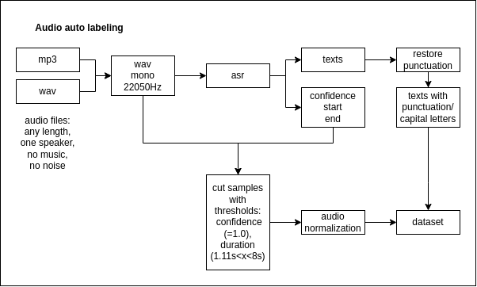

# audio-automatic-labeling
Automatic labeling of audio data for Tacotron 2 training

Audio automatic labeling is an algorithm for labeling audio using
[VOSK speech recognition and punctuation models](https://alphacephei.com/vosk/models).
The input audio files are split into samples of 1-8 seconds each with text transcription.
The format of the output dataset is similar to the [LJSpeech](https://keithito.com/LJ-Speech-Dataset/) dataset.

## Description

Input data:

* `mp3` or `wav` format
* 1 speaker
* no music
* no noise

Output dataset:

* audio + text samples
* duration 1-8 sec
* LJSpeech dataset format

Algorithm steps:

1. Audio preprocessing (conversion to `wav` mono, `SAMPLE_RATE` = 22050 Hz)
2. Automatic speech recognition (ASR):
   * get the words for each sample
   * get the start time, end time and confidence level for each word
3. Restoring punctuation marks and capital letters
4. Splitting audio into samples (the beginning of the sample is the beginning of the first word,
the end of the sample is the end of the last word)
5. Removing silence at the beginning and end of each sample with a threshold value of -30 dB
6. Skip samples whose duration is less than `MIN_TIME`,
more than `MAX_TIME` or the average confidence level for all words is less than `MIN_CONF`
7. Volume normalization:
   * for each audio file, the mean value `[m1, m2, ...]` and 
   the standard deviation `[d1, d2, ...]` of the sample volume are calculated
   * the average values of the mean volumes `m = mean([m1, m2, ...])` and
   standard deviations of the volume `d = std([d1, d2, ...])` for all audio files are calculated
   * converting the volume distribution of each audio file to the normal distribution `N(m, d)`
   (assuming that the audio volume has a normal distribution)
8. (OPTIONAL) Adding silence with a duration of `SILENCE_START` at the beginning and
`SILENCE_END` at the end of each sample.
9. (OPTIONAL) Creating a train/val/test split in the `data/filelists` folder in the
[NVIDIA/tacotron2](https://github.com/NVIDIA/tacotron2) style.

*Note: Steps 8-9 are optional and only needed for Tacotron 2 training.*
*When training Tacotron 2, it is [recommended](https://github.com/NVIDIA/tacotron2/issues/269)*
*to add silence at the beginning and end of the audio, as this will improve the learned attention alignments.*



Data file structure:

* `metadata.csv` - text labels in [LJSpeech](https://keithito.com/LJ-Speech-Dataset/) format
* `dataset_stat.txt` - dataset statistics in [LJSpeech](https://keithito.com/LJ-Speech-Dataset/) format
* `raw` - audio files in `mp3` or `wav` format
* `input` - preprocessed audio files in `wav` format (mono, 22.05 kHz)
* `asr` - recognised text fragments in `json` format
* `punc` - text fragments with restored punctuation and capital letters in `json` format
* `wavs` - dataset samples in `wav` format
* `filelists` - train, val and test sample names (format copied from training
[NVIDIA/tacotron2](https://github.com/NVIDIA/tacotron2) on LJSpeech dataset) in `txt` format

```
data
│   metadata.csv
│   dataset_stat.txt
└───raw
│   │   file1.mp3
│   │   file2.wav
│   └───file3
│       │   file31.mp3
│       │   file32.wav
│       │   ...
│
└───input
│   │   file1.wav
│   │   ...
│
└───asr
│   │   file1.json
│   │   ...
│
└───punc
│   │   file1.json
│   │   ...
│
└───wavs
│   │   001-0001.wav
│   │   ...
│
└───filelists
    │   train.txt
    │   val.txt
    │   test.txt
```

## Setup

1. Clone this repo: `git clone https://github.com/MikhailSukhovei/audio-automatic-labeling.git`
2. CD into this repo: `cd audio-automatic-labeling`
3. Install python requirements: `pip install -r requirements.txt`
4. Download [VOSK speech recognition model](https://alphacephei.com/vosk/models) into `vosk_models` folder.

    For example, english `vosk-model-en-us-0.22` model:
    
    ```
    wget https://alphacephei.com/vosk/models/vosk-model-en-us-0.22.zip
    unzip vosk-model-en-us-0.22.zip
    mkdir -p vosk_models
    mv vosk-model-en-us-0.22 vosk_models/vosk-model-en-us-0.22
    rm -rf vosk-model-en-us-0.22.zip
    ```

5. Download [VOSK punctuation model](https://alphacephei.com/vosk/models) into `vosk_models` folder.

    For example, english `vosk-recasepunc-en-0.22` model:
    
    ```
    wget https://alphacephei.com/vosk/models/vosk-model-en-us-0.22.zip 
    unzip vosk-model-en-us-0.22.zip
    mkdir -p vosk_models
    mv vosk-model-en-us-0.22 vosk_models/vosk-model-en-us-0.22
    rm -rf vosk-model-en-us-0.22.zip
    ```

6. Change default stop-rules in speech recognition model `conf/model.conf` file:

   * `rule2 = 0.015625`
   * `rule3 = 0.03125`
   * `rule4 = 0.0625`

   ```
   sed -i -e '/\-\-endpoint\.rule2\.min\-trailing\-silence *=/s/=.*/=0\.015625/' /vosk_models/vosk-model-en-us-0.22/conf/model.conf
   sed -i -e '/\-\-endpoint\.rule3\.min\-trailing\-silence *=/s/=.*/=0\.03125/' /vosk_models/vosk-model-en-us-0.22/conf/model.conf
   sed -i -e '/\-\-endpoint\.rule4\.min\-trailing\-silence *=/s/=.*/=0\.0625/' /vosk_models/vosk-model-en-us-0.22/conf/model.conf
   ```
       
*Note: The best parameters for stop rules were obtained based on the russian language data with 1 voice,*
*so they can be adjusted in the future.*

## Run

VOSK speech recognition models supports only CPU running

1. Save audio files into `data/raw` folder
2. Run `python labeling.py`

## Results

input: 7 audiobooks (russian female speaker)

output: ~21 hours dataset

|                     |           |
|---------------------|-----------|
| Total Clips         | 38,400    |
| Total Words         | 218,014   |
| Total Characters    | 1,346,661 |
| Total Duration      | 22:50:22  |
| Mean Clip Duration  | 2.14 sec  |
| Min Clip Duration   | 1.11 sec  |
| Max Clip Duration   | 7.91 sec  |
| Mean Words per Clip | 5.68      |
| Distinct Words      | 34,017    |

Tacotron 2 (training from scratch) + [waveglow](https://drive.google.com/file/d/1rpK8CzAAirq9sWZhe9nlfvxMF1dRgFbF/view)

[](https://www.youtube.com/watch?v=mCeGVLL2oN0)

* input: 1 audiobook (english male speaker)

* output: ~30 minutes dataset

|                     |     |
|---------------------|-----|
| Total Clips         | -   |
| Total Words         | -   |
| Total Characters    | -   |
| Total Duration      | -   |
| Mean Clip Duration  | -   |
| Min Clip Duration   | -   |
| Max Clip Duration   | -   |
| Mean Words per Clip | -   |
| Distinct Words      | -   |

Tacotron 2 (training from 
[LJSpeech checkpoint](https://drive.google.com/file/d/1c5ZTuT7J08wLUoVZ2KkUs_VdZuJ86ZqA/view)) + 
[waveglow](https://drive.google.com/file/d/1rpK8CzAAirq9sWZhe9nlfvxMF1dRgFbF/view)

[Video]

## ToDo

* add [Spleeter source separation model](https://github.com/deezer/spleeter) to separate voice from music
* add [VOSK speaker identification model](https://alphacephei.com/vosk/models) to create datasets with multiple speakers
* add noises filtering
